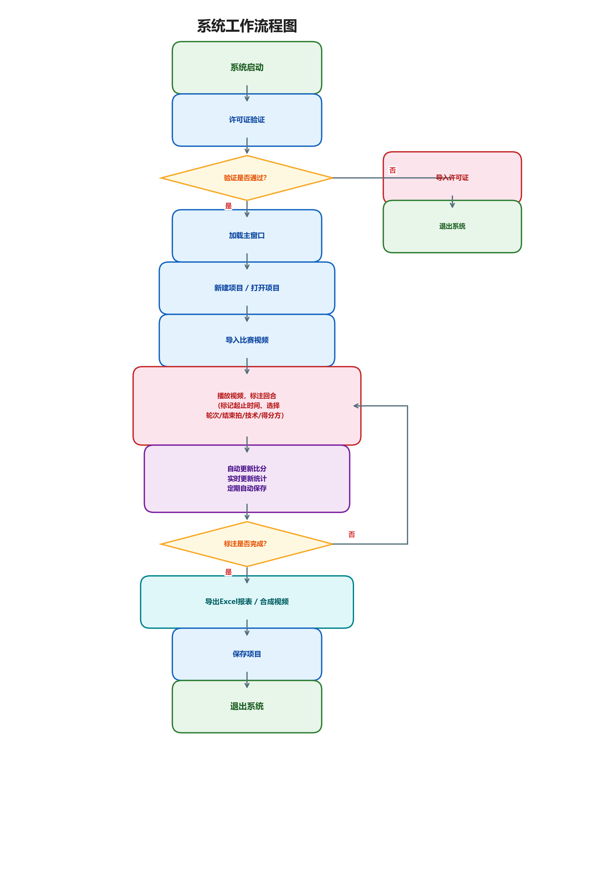
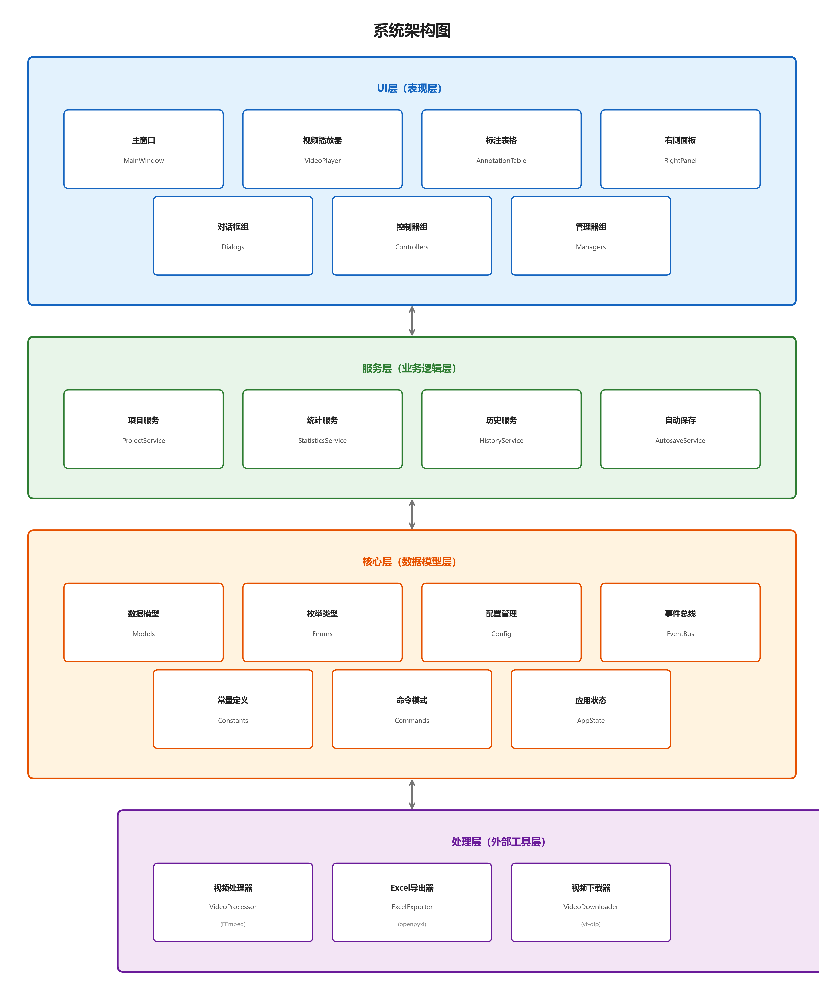

# OpenCode 全能开源 AI 编程利器 —— 综合指南

> 从核心概念入门、AI 协作实战、到企业级安全部署的一站式进阶蓝图

欢迎来到 AI 驱动开发的全新时代。如果你正试图打破厂商锁定的枷锁，追求真正的"模型自由"与"工程自主"，那么 OpenCode 就是你通往未来的通行证。本指南将带你从单一工具的使用者，进化为 AI 多智能体团队的指挥官——一位真正的"AI 经理人"。





---

## 目录

- [第一章 宏观认知：从"封闭果园"走向"开放安卓"](#第一章--宏观认知从封闭果园走向开放安卓)
- [第二章 战前准备：环境搭建与部署形态](#第二章--战前准备环境搭建与部署形态)
- [第三章 行为准则：Plan 与 Build 双模式](#第三章--行为准则plan-与-build-双模式)
- [第四章 项目之魂：/init 指令与 AGENTS.md](#第四章--项目之魂init-指令与-agentsmd)
- [第五章 访问策略：顶级模型接入与安全避险](#第五章--访问策略顶级模型接入与安全避险)
- [第六章 武器库解密：Plugins、MCP 与 Skills](#第六章--武器库解密pluginsmcp-与-skills)
- [第七章 核心利器指令](#第七章--核心利器指令)
- [第八章 极致进化：Oh My OpenCode (OMO) 多智能体协作](#第八章--极致进化oh-my-opencode-omo-多智能体协作)
- [第九章 可靠性工程：深度攻坚与异常恢复](#第九章--可靠性工程深度攻坚与异常恢复)
- [结语 拥抱 AI 驱动的自主权](#结语--拥抱-ai-驱动的自主权)

---

## 第一章  宏观认知：从"封闭果园"走向"开放安卓"

### 1.1 生态定位：Provider-agnostic 的开源 AI 智能体

理解 OpenCode 的第一步是认清它的生态位。商业 AI 工具（如 Claude Code）更像是"苹果手机"：它优雅、稳定，但你必须被圈禁在它的"围墙花园"内，只能使用单一厂商的模型。而 OpenCode 则是 AI 界的"安卓系统"：它彻底开源、高度可定制，且具备最核心的属性——**提供商无关（Provider-agnostic）**。

在企业级 AI 开发领域，OpenCode 的战略定位已超越了单纯的对话助手，它是一款真正意义上的开源 AI 智能体。通过 OpenCode，企业和个人可以根据模型性能、响应延迟与调用成本，在 OpenAI、Anthropic、Google 及本地大模型之间灵活切换，确保开发链路不因单一供应商的策略调整而中断。

| 特性 | 传统商业 AI 工具（如 Claude Code） | OpenCode 开源生态 |
|------|------|------|
| 开放性 | 闭源果园，由商业公司定义规则 | 100% 开源，社区驱动，打破黑盒 |
| 模型选择 | 强绑定单一模型（如仅限 Claude） | 支持 75+ 模型，自由混搭 GPT/Claude/Gemini |
| 账号安全 | 地区限制严苛，极易触发封号禁令 | 通过中转 API 或本地认证，规避地域封锁风险 |
| 隐私/本地化 | 数据必须上传云端，无离线选项 | 支持 LM Studio 等本地模型，实现极致隐私 |
| 定制化 | 较低，难以深度修改底层逻辑 | 极高，像配置 Linux 一样定制你的 AI 助手 |

### 1.2 认知重塑：从"写代码"到"管理 AI"

在传统编程模式中，开发者深陷语法细节。而 OpenCode 倡导的是"管理者思维"。AI 管理者不再纠结于"如何写这一行代码"，而是思考"如何定义项目的'宪法'，并挑选最合适的 AI 专家去执行它"。

| 维度 | 传统编程思维（IDE） | AI 管理者思维（OpenCode） |
|------|------|------|
| 核心焦点 | 手写语法、调试 Bug、关注实现细节 | 梳理需求逻辑、分配任务、审核结果 |
| 资源利用 | 依赖个人脑力，受限于特定 IDE 环境 | 多模型编排：让擅长逻辑的做架构，擅长视觉的做 UI |
| 协作模式 | 单打独斗，效率受限于个人体力 | 多智能体并行：组建一支 AI 开发团队 |
| 安全与风险 | 官方工具对中国开发者限制严苛，极易封号 | 通过中转 API 或 OAuth 轮询，规避账号风险 |

---

## 第二章  战前准备：环境搭建与部署形态

### 2.1 安装路径

建议优先使用命令行版（CLI），它具备最强的工程执行力，能够直接改代码、跑命令、执行自动化脚本。企业环境对权限控制极其敏感，在部署时应严格遵循 OpenCode 的安装目录优先级：系统首先检索 `$OPENCODE_INSTALL_DIR`，其次为 `$XDG_BIN_DIR`。

```bash
# 一键安装（YOLO 脚本）
curl -fsSL https://opencode.ai/install | bash

# 通用安装（npm）
npm install -g opencode
```

### 2.2 多形态部署方式

| 部署形态 | 核心亮点 | 适用场景 |
|------|------|------|
| CLI (命令行) | 工程执行力最强，支持并行任务处理（Session），深度集成 TUI 交互 | 核心工程落地、全项目重构、自动化脚本运行 |
| IDE 插件 (VS Code) | 极佳的即时上下文关联，支持 Alt+K 将选定代码同步至 AI 会话 | 编码过程中的即时补全、单文件小步快跑 |
| 桌面版 (App) | 图形化界面友好，可视化管理多会话，文档整理体验更佳 | 架构复盘、非技术性分析、跨项目文档管理 |
| 云端自动化 (GitHub) | 集成 GitHub Actions，支持 Issue 驱动的自动修复与 PR 生成 | 远程仓库维护、全自动 Bug 修补、流水线集成 |

### 2.3 配置文件总控中心

所有配置最终都存储在本地的 JSON 文件中。如果发现某些插件无法加载，这里是你的第一检查站：

- **Windows**：`C:\Users\用户名\.config\opencode\opencode.json`
- **macOS / Linux**：`~/.config/opencode/opencode.json`

**配置文件加载优先级（从高到低）：**

1. 远程配置 (`.well-known/opencode`)
2. 全局配置 (`~/.config/opencode/opencode.json`)
3. 自定义配置 (`OPENCODE_CONFIG` 环境变量)
4. 项目配置 (项目根目录 `opencode.json`)
5. `.opencode` 目录 (`agents`, `commands`, `plugins`)
6. 内联配置 (`OPENCODE_CONFIG_CONTENT` 环境变量)

---

## 第三章  行为准则：Plan 与 Build 双模式

为了防止 AI 在复杂代码库中造成不可逆的破坏或产生"AI 废料"，OpenCode 严密区分了两大运行模式。理解这两者的差异，是实现"手术级精准开发"的前提，也是工程安全的首道防火墙。

### 3.1 Plan 模式（动口）—— AI 的"架构师脑"

即"Read-only"模式。在此模式下，AI 仅具备代码阅读、逻辑分析与方案规划权限，严禁修改任何文件。这是理清架构思路、防止非预期修改的必经阶段，旨在进行"上下文瘦身（Context lean-out）"和方案评审。适用于需求调研、Bug 定位、确认重构方案。

### 3.2 Build 模式（动手）—— AI 的"手术刀手"

真正的"干活模式"。AI 获得最高授权，可直接编写代码、运行终端命令（如 `npm install`）、修改或删除文件。这是执行"外科手术式代码重构"的战场。适用于方案确认后的正式交付。

### 3.3 管理者准则

利用 **Tab 键**可以在 Plan 与 Build 模式间一键无缝切换。永远不要让 AI 在没有计划的情况下动手。

**最佳实践流程：**

1. 先在 Plan 模式聊透需求并确认方案
2. 看到 AI 给出 Todo List
3. 按 Tab 键切换至 Build 模式
4. 下令"按照计划执行"

---

## 第四章  项目之魂：/init 指令与 AGENTS.md

一个没有规范的项目会导致 AI "乱写"。在任何复杂任务启动前，必须在项目根目录运行的第一条指令：

```
/init
```

### 4.1 核心产物：AGENTS.md

运行 `/init` 后，AI 会通读整个项目目录并生成 `AGENTS.md` 文件。该文件被形象地称为项目的"记忆芯片"或"宪法"。它不仅是项目的记忆仓库，更是强制约束 AI 行为的最高准则。

**AGENTS.md 的核心作用：**

- **项目记忆**：记录技术栈（如 React + Vite）、编码规范（如变量命名风格）和目录结构
- **持久化约束**：充当 AI 的长期记忆，无论切换哪个模型，AI 都会先读取此文件，确保生成的代码风格与现有项目 100% 统一
- **杜绝幻觉**：通过显式定义工程标准，有效遏制 AI 产生冗余代码（AI Slop）

### 4.2 文件放置位置

`AGENTS.md` 是一个标准化格式，已被 60,000+ 开源项目采用，Cursor、Claude Code、VS Code 等多平台都支持。OpenCode 支持在多个层级放置规则文件：

- **项目级**：放在项目根目录 `./AGENTS.md`（推荐提交到 Git）
- **全局级**：放在 `~/.config/opencode/AGENTS.md`（个人规则，应用于所有会话）
- **优先级**：本地 AGENTS.md > 全局 AGENTS.md > CLAUDE.md（兼容）

---

## 第五章  访问策略：顶级模型接入与安全避险

### 5.1 三大"大脑"来源

**内置免费模型：** 启动后输入 `/models`，选择带 `free` 标记的模型（如 minimax-m2.1），适合新手零门槛练手。

**Antigravity 插件（白嫖顶级模型额度）：** 这是目前最火的方案，允许你通过 OAuth 接入 Google 的 IDE 环境额度，可调用 Claude Opus 4.5、Sonnet 4.5 及 Gemini 3 Pro/Flash 等顶级模型。在 `opencode.json` 中配置：

```json
{ "plugin": ["opencode-antigravity-auth@latest"] }
```

然后运行 `opencode auth login`，选择 Google -> Antigravity 完成身份验证。

**自定义 API（避风港）：** 在 `opencode.json` 的 `providers` 字段中接入 OpenRouter 或国内中转站（如智谱、MiniMax）的 API Key。这是规避官方封号风险的最佳方案。

### 5.2 账号风控与安全准则

> ⚠️ **高风险场景警告：**

- **新账号高压操作**：新注册的 Google 账号极易在首次调用高级 API 时触发风控。如果使用 Antigravity 插件，绝对避免使用新注册的 Google 账号，请使用有一定活跃历史的账号
- **Pro/Ultra 订阅关联**：关联了付费订阅的新账号，若通过非官方渠道频繁调用，极易遭遇"隐形降权"或永久封禁（Shadow-ban）
- **Anthropic 封锁风险**：2026 年 1 月，Anthropic 已以 oh-my-opencode 为由限制第三方 OAuth 访问，用户需注意服务条款风险
- **认证回调问题**：在 macOS 上，Safari 的 HTTPS-Only 模式会拦截 `localhost:51121` 的 OAuth 回调，建议临时关闭或切换至 Chrome

### 5.3 多供应商混搭（Hybrid）架构

OpenCode 允许开发者构建多模型协同的"全明星团队"，根据任务类型指派最擅长的模型：

- **架构师**：指派 GPT-5.3 Codex 负责宏观设计
- **逻辑工匠**：由 Claude 4.5/4.6 负责核心代码与复杂逻辑
- **视觉专家**：利用 Gemini 3 Pro 处理 UI/UX 设计
- **研究员**：让 Claude Sonnet 查阅文档与开源库

### 5.4 配额调度：多账号轮询与速率限制

单账号配额在高通量开发面前是脆弱的。通过精细化配置 `antigravity-accounts.json`，可以实现真正的"无感"开发。插件支持在多个 Google 账号间自动轮询，建议开启 `pid_offset_enabled` 参数以均匀分摊请求压力。

**配额保护机制：** 软配额阈值（`soft_quota_threshold_percent`）默认设为 90%，当账号额度接近上限时系统会主动跳过该账号。系统具备"Fail-Open"行为——若配额缓存超过 `soft_quota_cache_ttl_minutes` 定义的有效期，系统会将账号状态视为"Unknown"并允许通过，防止因缓存过旧导致的误拦截。

**调度模式选择：**

- **cache_first（推荐）**：系统优先等待原账号恢复，保护提示词缓存（Prompt Cache），在长对话中极大降低 Token 成本
- **balance**：一旦触发限制即切换账号，适用于快速、碎片的任务
- **performance_first**：多账号并行轮转，适合高并发的自动化测试流

---

## 第六章  武器库解密：Plugins、MCP 与 Skills

OpenCode 拥有一套极其庞大的外部"武器库"来扩展其处理复杂任务的能力。初学者常混淆 Plugins、MCP 和 Skills 三个概念，我们将它们按功能维度清晰拆解：

### 6.1 Plugins（插件）—— 软件功能的横向暴力扩充

代表作：`opencode-antigravity-auth`，通过模拟 Google IDE 环境，让你直接调用 Claude Opus 4.5 和 Gemini 3 Pro 等顶级模型额度。用户插件现在可以覆盖内置插件（相同 provider 时用户插件优先加载）。在 `opencode.json` 的 `plugin` 数组中配置插件名称即可。

### 6.2 MCP（模型上下文协议）—— 数据的外部感官连接器

MCP（Model Context Protocol）是一个开放协议，让 AI 能够连接外部数据源和工具。通过 MCP，AI 可以连接 Google 搜索获取实时信息、读取你的 Notion 数据库、调用官方 API 文档等。

**本地 MCP 服务器配置示例：**

```json
{
  "mcp": {
    "server-name": {
      "type": "local",
      "command": ["npx", "-y", "my-mcp-command"],
      "enabled": true
    }
  }
}
```

**远程 MCP 服务器配置示例：**

```json
{
  "mcp": {
    "server-name": {
      "type": "remote",
      "url": "https://api.example.com/mcp",
      "headers": { "Authorization": "Bearer xxx" },
      "enabled": true
    }
  }
}
```

**常用 MCP CLI 管理命令：**

- `opencode mcp add` — 添加服务器
- `opencode mcp list` — 列出已配置
- `opencode mcp auth [name]` — 认证
- `opencode mcp debug [name]` — 测试连接

> 注意：MCP 服务器会增加上下文 Token 消耗，请按需使用，避免超出上下文限制。

### 6.3 Skills（技能）—— 标准作业程序的固化封装

将复杂的"报销流程"或"UI 组件转换流"封装成可复用的标准化指令（SOP），显著降低处理跨学科复杂任务的认知门槛。Skills 可以在 `.opencode` 目录中定义，实现团队级的知识固化与共享。

---

## 第七章  核心利器指令

掌握以下核心指令，是高效使用 OpenCode 的基础：

| 指令 | 功能说明 | 使用场景 |
|------|------|------|
| `/init` | 扫描项目目录，生成 AGENTS.md 项目宪法文件 | 新项目启动、项目初始化 |
| `/models` | 查看并切换可用的 AI 模型 | 选择最佳模型、查看 free 标记模型 |
| `/timeline` | 查看任务检查点，记录代码变化和对话演进 | 版本回溯、查看历史状态 |
| `/revert` | "后悔药"，将代码和 AI 对话同步回滚到指定时间点 | AI 方案偏离预期时的紧急回滚 |
| `/compact` | 提炼对话摘要，释放上下文空间 | 会话过长时降低"逻辑断点"概率 |
| `/session` (或 `sess`) | 多任务并行管理，在不同 Session 间切换 | 同时开 Session A 改 Bug、Session B 做新功能 |
| `continue` | 触发系统自我恢复逻辑 | 执行过程中卡死时的恢复手段 |

### 7.1 状态回滚的独特价值

OpenCode 提供的 `/timeline` 结合 `/revert` 是优于 Git 的回溯机制。它不仅能回滚代码状态，还能同步回滚 AI 的对话上下文。这在 AI 方案偏离预期时至关重要，能让 AI 在逻辑分支点重新尝试，避免错误上下文的持续污染。对于初学者而言，这套"全知视角"安全网可以彻底消除恐惧感——不怕 AI 写坏代码，因为随时可以"穿越回去"。

---

## 第八章  极致进化：Oh My OpenCode (OMO) 多智能体协作

从"单一对话"向"多智能体协作"的转型，标志着开发范式的迁跃。当你追求"一人抵一个团队"时，Oh My OpenCode (OMO) 插件就是你的终极武器。它通过 Sisyphus 主控智能体，将开发流程转化为全自动生产线。

### 8.1 Sisyphus（西西弗斯）：纪律智能体

作为团队的"总调度员"，Sisyphus（通常驱动自 Claude 4.5/4.6 Thinking）拥有极高的执行逻辑。它不仅拆解任务生成 Todo List，更具备"完工保证机制"：如果子智能体因模型截断或其他原因中途退出，Sisyphus 会强制将其拉回"推石上山"的循环（Bouldering Mode），直至 100% 达成目标。

### 8.2 专家矩阵与模型映射

OMO 的核心价值在于将特定领域任务派发给最擅长的模型：

| 智能体 | 角色定义 | 推荐模型 |
|------|------|------|
| Sisyphus (总调度) | 包工头。拆解任务清单，监督子智能体进度 | Claude 4.5/4.6 Thinking |
| @oracle (先知) | 首席架构师。处理核心逻辑、攻坚复杂 Bug | Gemini 3 Pro / GPT-5.3 |
| @librarian (图书管理员) | 技术研究。查阅官方文档与开源库实现 | Claude Sonnet 4.5 |
| @explore (探索者) | 情报尖兵。通过 Contextual Grep 快速扫描代码库 | Claude Haiku 4.5 |
| @frontend (前端) | UI 专家。利用视觉能力处理 CSS/布局还原 | Gemini 3 Pro (Visual) |

### 8.3 魔法指令：ultrawork (ulw)

在提示词中加入 `ultrawork`（或缩写 `ulw`），即可激活多智能体协作流。此时系统会启动"任务延续执行器"（Task Continuation Enforcer），像神话中的西西弗斯一样，AI 会不断"推石头"直到任务 100% 完成，全程无需人工干预。

**实战示例：** 输入 `ulw 帮我创建一个带数据看板和深色模式的财务管理后台`。你将看到 Sisyphus 自动创建 Todo List，指挥 @frontend 编写界面，同时让 @oracle 设计数据逻辑。各模型并行工作，效率呈指数级提升。

### 8.4 安全提醒

> ⚠️ **重要警告**：OMO GitHub 仓库（code-yeongyu/oh-my-opencode）官方明确警告 `ohmyopencode.com` 并非官方网站，而是一个付费墙冒牌站点。真正的项目在 GitHub 上完全免费且开源。此外，2026 年 1 月 Anthropic 已以 oh-my-opencode 为由限制了第三方 OAuth 访问，用户需注意相关服务条款风险。

---

## 第九章  可靠性工程：深度攻坚与异常恢复

### 9.1 拉尔夫循环 (Ralph-Loop)

输入 `/ralph-loop`（或 `/R`）。与 ultrawork 的广度搜索不同，Ralph-Loop 侧重于深度攻坚。AI 会进入一个"编码-测试-重构"的长效闭环，直到所有测试用例（Test Cases）100% 通过。这适合处理涉及多个文件且逻辑高度耦合的硬核工程问题，如大规模架构迁移或 8000+ Lint 错误修复。

> ⚠️ **CAUTION 警告**：`/R` 模式会让 AI 进入永续迭代循环，可能持续数小时直至 100% 通过所有测试。请务必在电力和 Token 充足的情况下开启。

### 9.2 思考预算（Thinking Budget）

在使用 Antigravity 的顶级模型时，可以通过参数 `--variant=max` 或配置 `thinkingBudget` 来控制 AI 的思考深度。更高的预算意味着 AI 会进行更深层次的逻辑推理，适合复杂的架构设计和深度 Bug 分析。

### 9.3 故障诊断与手动介入

| 故障场景 | 处理方案 |
|------|------|
| 认证循环（Auth Loop）：无限跳转认证 | 删除 `~/.config/opencode/antigravity-accounts.json` 并执行 `opencode auth login` |
| Token 压力：会话过长导致逻辑断点 | 使用 `/compact` 提炼摘要，释放上下文空间 |
| 执行卡死 | 输入 `continue` 触发系统自我恢复逻辑 |
| AI 方案偏离预期 | 用 `/timeline` 查看检查点，用 `/revert` 回滚到正确状态 |

---

## 结语  拥抱 AI 驱动的自主权

OpenCode 并非只是另一个 AI 助手，它是一套民主化的智能调度方案。它赋予你不再被单一厂商绑架的权力，让你像配置安卓手机一样，打造出专属于自己的"AI 梦之队"。

从今天起，请记住你是一名 AI 项目经理。掌握 OpenCode 的核心在于：

- **规范先行**：始终先 `/init` 建立 AGENTS.md 约束
- **分级授权**：先 Plan 确认谋略，后 Build 交付执行
- **团队协作**：善用 `ultrawork` 压榨多模型的潜能，用 `/R` 保证交付质量
- **安全网**：不怕 AI 写坏代码，因为你有 `/revert`；不怕复杂任务，因为你有 Sisyphus

通过 OpenCode 与 OMO 插件的深度集成，个人开发者能够以极低的资源成本驱动团队级别的开发效能，同时在安全架构的保护下，实现高效、可靠的代码交付。现在，在你的终端输入 `/models`，选择你的第一个模型，开启属于你的 AI 智能体自由之路吧！

---

[← 返回 AI 工具分类](../README.md) | [← 返回首页](../../README.md)
